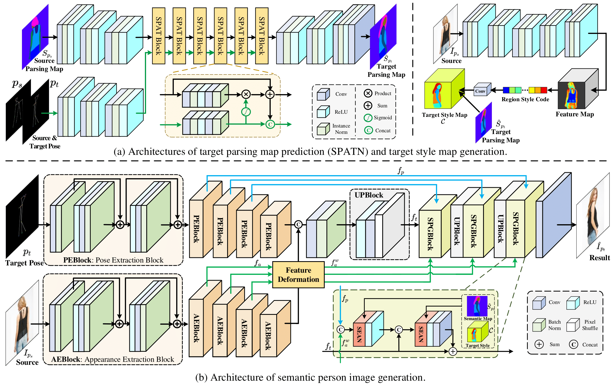

# [Learning Semantic Person Image Generation by Region-Adaptive Normalization](https://arxiv.org/pdf/2104.06650.pdf)

The source code for our paper "Learning Semantic Person Image Generation by Region-Adaptive Normalization" (CVPR 2021)



## Quick Start

### Installation

**Clone this repo**

   ```
git clone https://github.com/cszy98/SPGNet.git.
cd SPGNet
   ```

**Prerequisites**    

    - python3.7
    - pytorch1.2.0 + torchvision0.4.0
    - numpy
    - opencv
    - tqdm

Create environment and install dependencies:

```
# 1. Create a conda virtual environment.
conda create -n spgnet python=3.7 anaconda
source activate spgnet

# 2. Install dependency
pip install -r requirement.txt
```

### Data Preparation

The DeepFashion and Market-1501 datasets can be downloaded from [GoogleDrive](https://drive.google.com/drive/folders/1TR9hcabKA94PZA7cj5g7nodKEbzpyg1e?usp=sharing).

### Testing and Evaluate

The pretrained models can be downloaded from [GoogleDrive](https://drive.google.com/drive/folders/1TR9hcabKA94PZA7cj5g7nodKEbzpyg1e?usp=sharing).

**Test on DeepFashion**

 ```
python scripts/test_pose_transfer_model.py     --id deepfashion     --gpu_ids 0     --dataset_name deepfashion     --which_model_G dual_unet     --G_feat_warp 1     --G_vis_mode residual     --pretrained_flow_id FlowReg_deepfashion     --pretrained_flow_epoch best     --dataset_type pose_transfer_parsing     --which_epoch latest     --batch_size 4     --save_output     --output_dir output
 ```

**Test on Market-1501** 

 ```
python scripts/test_pose_transfer_model.py  --id market  --gpu_ids 0  --dataset_name market  --which_model_G dual_unet  --G_feat_warp 1  --G_vis_mode residual  --pretrained_flow_id FlowReg_market  --pretrained_flow_epoch best  --dataset_type pose_transfer_parsing_market  --which_epoch latest  --batch_size 1  --save_output  --output_dir output
 ```

**Evaluate**

Run ``eval_deepfashion.sh`` and  ``eval_market.sh`` to evaluate LPIPS and FID on DeepFashion and Market-1501, respectively.

To evaluate the PCKh, download pose estimator from [GoogleDrive](https://drive.google.com/file/d/1Y1WWYKUhCnei2dFxf8gj9lKJswR73arh/view?usp=sharing) and put it under the root folder. Then change the path in  `tool/compute_coordinates.py` and launch ``python2 compute_coordinates.py``. After that, launch `python tool/calPCKH_market.py` or `python tool/calPCKH_fashion.py` to get PCKh. Please refer to [Pose-Transfer](https://github.com/tengteng95/Pose-Transfer#evaluation) for more details. 

### Training

**1. Train on DeepFashion**

```
python scripts/train_pose_transfer_model.py     --id deepfashion     --gpu_ids 0,1     --dataset_name deepfashion     --which_model_G dual_unet     --G_feat_warp 1     --G_vis_mode residual     --pretrained_flow_id FlowReg_deepfashion     --pretrained_flow_epoch best     --dataset_type pose_transfer_parsing     --check_grad_freq 3000     --batch_size 4     --n_epoch 45
```
**2. Train on Market-1501**

```
python scripts/train_pose_transfer_model.py --id marketest --gpu_ids 0,1,2,3 --dataset_name market --which_model_G dual_unet --G_feat_warp 1 --G_vis_mode residual --pretrained_flow_id FlowReg_market --pretrained_flow_epoch best --dataset_type pose_transfer_parsing_market --check_grad_freq 3000 --batch_size 32 --n_epoch 10
```
## Citation

If you find our work useful in your research or publication, please cite:

    @article{lv2021learning,
      title={Learning Semantic Person Image Generation by Region-Adaptive Normalization},
      author={Lv, Zhengyao and Li, Xiaoming and Li, Xin and Li, Fu and Lin, Tianwei and He, Dongliang and Zuo, Wangmeng},
      booktitle = {IEEE Conference on Computer Vision and Pattern Recognition},
      year = {2021}
    }
## Acknowledgments

This code borrows heavily from [intrinsic_flow](https://github.com/ly015/intrinsic_flow)  and [Pose-Transfer](https://github.com/tengteng95/Pose-Transfer).